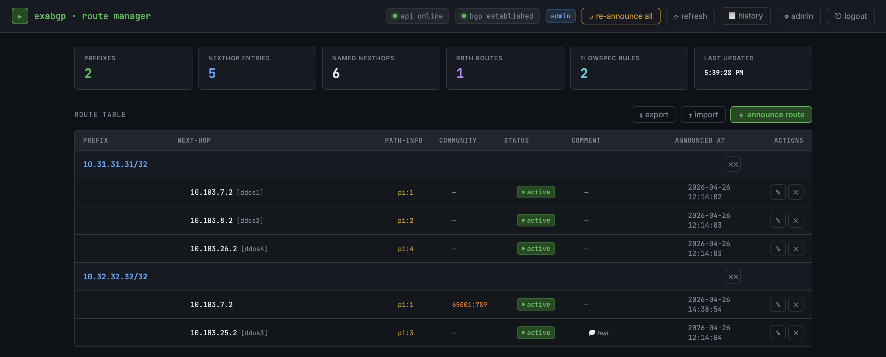

# ExaBGP Route Manager

A Docker-based web GUI and REST API for managing dynamic BGP route announcements via [ExaBGP](https://github.com/Exa-Networks/exabgp). Built for network operators who need to announce, withdraw, and audit BGP routes (multi-nexthop, simple, RBTH, flowspec) without writing ExaBGP commands by hand.



## What It Does

- Announces and withdraws BGP routes from a web UI or REST API — no shell access to ExaBGP needed
- Persists every announce in SQLite and **auto re-announces** after ExaBGP/container restart
- Audits every operation with the user/token that performed it (90-day history)
- Sits behind HAProxy with TLS, multi-user authentication, and role-based access

## Architecture

```
[Browser / curl]
       │
       ▼ HTTPS :443  (HTTP :80 → 301 redirect)
  ┌─────────────┐
  │   HAProxy   │  SSL termination · self-signed cert
  └──────┬──────┘
         │ HTTP :5001  (internal Docker network only)
         ▼
  ┌─────────────┐
  │  Flask API  │  session + token auth · role-based access
  └──────┬──────┘
         │ named pipes  exabgp.in / exabgp.out  (shared volume)
         ▼
  ┌─────────────┐
  │   ExaBGP    │  BGP peer
  └─────────────┘
```

## Features

**Route types**
- **Simple routes** — single nexthop with full BGP attribute control: local-preference, community, as-path, med, origin
- **Multi-nexthop routes** — same prefix announced via multiple next-hops with BGP add-path path-information
- **RBTH** — Remote Triggered Black Hole with `next-hop self`, supports per-ISP standard (`X:Y`) and large (`X:Y:Z`) communities, mixable in a single announce
- **Flowspec** — RFC 5575 discard and rate-limit actions

**Networking**
- IPv4 and IPv6 dual-stack — named next-hops resolve to the correct address family per prefix
- `IPV6_SELF` for `next-hop self` over IPv4 transport
- Default per-type communities (`ROUTE_COMMUNITY`, `SIMPLE_COMMUNITY`) merged with per-route entries

**Operations**
- Web GUI at `/` — interactive tables, modals, live BGP status indicator
- REST API at `/api/*` — Bearer token auth (admin or readonly)
- **Swagger UI at `/apidocs`** — try every endpoint from the browser
- Full export/import as JSON for backup or migration between instances

**Auth & audit**
- Default admin from `.env` + DB-managed users and tokens (bcrypt, GitHub-PAT-style tokens shown once)
- Every operation logged with the performing user, visible in the main route tables and the history page (90-day retention, CSV export)

**Reliability**
- SQLite persistence with auto re-announce on ExaBGP restart, BGP session recovery, or `/api/reannounce`
- IP normalization (host bits zeroed automatically)
- Flowspec safety: source and destination cannot both be `0.0.0.0/0` simultaneously

---

## Installation

Requires Docker and Docker Compose.

```bash
git clone https://github.com/cihanakgun/exabgp-docker-gui-api.git && cd exabgp-docker-gui-api

# Runtime directories
mkdir -p exabgp-run    && chmod 777 exabgp-run     # ExaBGP runs non-root, must be world-writable
mkdir -p haproxy-certs && chmod 700 haproxy-certs

# Named pipes for ExaBGP CLI (must exist before ExaBGP starts)
mkfifo exabgp-run/exabgp.in exabgp-run/exabgp.out
chmod 666 exabgp-run/exabgp.in exabgp-run/exabgp.out

# Configure
cp .env.example .env
vi .env exabgp.conf

# Run
docker compose up -d --build
docker compose logs -f api
```

Open `https://<host>` and log in with the credentials from `.env`. The HAProxy self-signed cert will trigger a browser warning the first time.

> **Updating files:** rebuild after changes to `api.py`, `Dockerfile` or anything in `static/` that's not bind-mounted: `docker compose up -d --build api`. Bind-mounted files (`exabgp.conf`, `.env`, files in `api/static/`) need only a restart.

> **Pipes lost?** If `exabgp-run/` is deleted or the container can't see the pipes, recreate with `mkfifo` then restart ExaBGP.

---

## Configuration

### `.env`

| Variable | Description | Default |
|----------|-------------|---------|
| `ADMIN_USERNAME` | Default admin GUI username | `admin` |
| `ADMIN_PASSWORD` | Default admin GUI password | — |
| `ADMIN_TOKEN` | Default admin API Bearer token | — |
| `FLASK_SECRET_KEY` | Flask session signing key | — |
| `EXABGP_PIPE_IN` | ExaBGP named pipe — send commands | `/opt/exabgp/run/exabgp.in` |
| `EXABGP_PIPE_OUT` | ExaBGP named pipe — read responses | `/opt/exabgp/run/exabgp.out` |
| `DB_PATH` | SQLite database path | `/opt/exabgp/run/routes.db` |
| `BGP_WAIT_TIMEOUT` | Seconds to wait for BGP before re-announce | `120` |
| `BGP_POLL_INTERVAL` | BGP status poll interval (seconds) | `5` |
| `NEXTHOP_<label>` | Named next-hop — IPv4 or `IPv4,IPv6` for dual-stack | — |
| `IPV6_SELF` | IPv6 address used as `next-hop self` for IPv6 prefixes when peering is over IPv4 | — |
| `ROUTE_COMMUNITY` | Default community for multi-nexthop route announces | — |
| `SIMPLE_COMMUNITY` | Default community for simple route announces | — |
| `RBTH_COMMUNITY` | Default community for RBTH (when no ISP selected) | `65000:666` |
| `BLACKHOLE_<name>` | ISP-specific blackhole community. Standard (`X:Y`) or large (`X:Y:Z`); mix is allowed and emits both `community [...]` and `large-community [...]` blocks. | — |
| `HISTORY_DAYS` | Days of history to retain | `90` |
| `TLS_CN` / `TLS_ORG` / `TLS_COUNTRY` / `TLS_DAYS` | TLS cert subject and validity | — |

> Passwords containing `$` must be written as `$$` in `.env` (Docker Compose escaping).

#### Named Next-Hops

```ini
NEXTHOP_ddos1=10.11.7.2,2001:124::3499   # dual-stack
NEXTHOP_ddos2=10.11.8.2                  # IPv4 only
```

Address family is selected automatically per prefix — IPv6 prefixes only see next-hops that have an IPv6 address.

#### ISP Blackhole Communities

```ini
RBTH_COMMUNITY=65000:666                       # default when no ISP selected
BLACKHOLE_cogent=65001:174:666                 # large
BLACKHOLE_gtt=65001:3257:666                   # large
BLACKHOLE_legacy=3257:666                      # standard
```

Selecting `cogent + gtt` emits `large-community [65001:174:666 65001:3257:666]`. Mixing standard and large produces both blocks. See **Guide.md** for details.

### `exabgp.conf`

```
neighbor <peer-ip> {
    router-id    <your-ipv4>;
    local-address <your-ipv4>;
    local-as     <your-asn>;
    peer-as      <peer-asn>;
    capability { add-path send/receive; }
    family {
        ipv4 unicast;
        ipv4 flow;
        ipv6 unicast;
        ipv6 flow;
    }
}
```

---

## Usage

### Web GUI — `https://<host>`

| Page | Path | Purpose |
|------|------|---------|
| Main | `/` | Live tables for simple routes, multi-nexthop routes, RBTH, flowspec — all CRUD operations |
| History | `/history` | Audit log with filters and CSV export |
| Admin | `/admin` | User and token management (admin role only) |
| **API Docs** | `/apidocs` | **Swagger UI — try every API endpoint from the browser** |

### REST API — `https://<host>/api/*`

```bash
curl -k https://<host>/api/status -H "Authorization: Bearer <token>"
```

| Role | API read | API write |
|------|----------|-----------|
| `admin` | ✓ | ✓ |
| `readonly` | ✓ | ✗ 403 |

Write endpoints (`announce`, `withdraw`, `import`, admin operations) require an admin token.

**See `Guide.md` for the full endpoint reference, request body schemas, and curl examples for every operation.**

### Swagger UI — `/apidocs`

The interactive API explorer at `/apidocs` lets you authorize once and try every endpoint without writing curl commands:

1. Open `https://<host>/apidocs`
2. Click **Authorize** (top right)
3. Paste your token (with or without `Bearer ` prefix) and confirm
4. Expand any endpoint → **Try it out** → edit the request body → **Execute**

The OpenAPI 2.0 spec is served at `/apispec.json` and can be imported into Postman, Insomnia, or any other client.

---

## Directory Structure

```
exabgp-docker-gui-api/
├── api/
│   ├── api.py
│   ├── Dockerfile
│   └── static/
│       ├── index.html
│       ├── history.html
│       └── admin.html
├── haproxy/
│   ├── Dockerfile
│   ├── haproxy.cfg
│   └── docker-entrypoint.sh
├── exabgp-run/        ← runtime: named pipes + sqlite db (created during install)
├── haproxy-certs/     ← runtime: TLS cert (created during install)
├── docker-compose.yml
├── exabgp.conf
└── .env
```

---

## Troubleshooting

**BGP shows "not established" but session is up**
The status is cached for 5 seconds (`BGP_POLL_INTERVAL`). Verify the pipe directly:
```bash
cat exabgp-run/exabgp.out &
echo "show neighbor summary" > exabgp-run/exabgp.in
sleep 1
```
You should see a peer line with `established` state.

**API container can't reach the ExaBGP socket**
The pipes must exist and be readable. Recreate them:
```bash
mkfifo exabgp-run/exabgp.in exabgp-run/exabgp.out
chmod 666 exabgp-run/exabgp.in exabgp-run/exabgp.out
docker compose restart exabgp api
```

**Routes not auto re-announcing after ExaBGP restart**
The pipe watchdog detects ExaBGP availability every 5 seconds. Check the API log — you should see `ExaBGP pipe reachable again — will reannounce after BGP comes up`. If not, trigger manually:
```bash
curl -k -X POST https://<host>/api/reannounce -H "Authorization: Bearer <admin-token>"
```


---

## Tested With

- ExaBGP `5.0.9` (`ghcr.io/exa-networks/exabgp:5.0.9`)
- HAProxy `2.9` (Alpine)
- Docker Compose v2
- Python 3.12 / Flask / flasgger

## License

MIT
